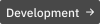
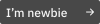
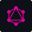

<h1 align="center"><strong>"Hello, World!"</strong> 🤓</h1>

<strong>Hi, I'm Stenio Almeida, developer focused on human experience. My biggest motivation is the opportunity to share knowledge, develop efficient and innovative solutions, and improve people's lives through technology!</strong>

## **About me**

💼 I'm currently working on my Portfolio. 
🌱 I'm currently learning more about **React** and **Next.js** 
🧐 I'm interested in **Flutter** and **Rust**. 
🤝🏼 I like to contribute to open source, social and pro bono projects 
💬 Ask me about anything [**here**](https://t.me/stenioas/) 
💌 Send me a message, it's free! 🤗

## **Techs & Tools**

<!-- Development -->

 
<!-- Scripting -->

 
<!-- Operating Systems -->

 
<!-- Tools -->

 
<!-- I'm newbie -->

## **Github Stats**

 

   

---

<strong>2021&copy;</strong> Made with 💕 by <strong>Stenio Almeida</strong>.

