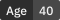
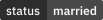
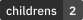
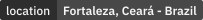
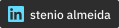
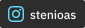
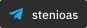
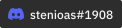

<h2 align="center"><strong>"Hello, World!"</strong> </h1>

Hi, I'm Stenio Almeida, developer focused on human experience. My biggest motivation is the opportunity to share knowledge, develop efficient and innovative solutions, and improve people's lives through technology!

<h2><strong>About me</strong></h2>

💼 I'm currently working on my **Portfolio**. 
🌱 I'm currently learning more about **React** and **Next.js** 
🧐 I'm interested in **Rust** and **Flutter**. 
🤝🏼 I like to contribute to open source, social and pro bono projects 
💬 Ask me about anything [**here**](https://t.me/stenioas/) 
💌 Send me a message, it's free! 🤗 
⚡ Fun fact: I make delicious tapiocas with grated coconut!

<h2><strong>Techs & Tools</strong></h2>

                  

<h5><strong>Beginner</strong></h5>

     

<strong>More about me...</strong>

 

 

 

---

<strong>2021&copy;</strong> Made with 💕 by <strong>Stenio Almeida</strong>.

