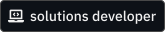
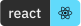
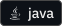
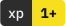

<a href="./README.en.md"><strong>README in English</strong></a>

<h1><strong>"Olá, Mundo!"</strong></h1>

        

<samp><em>Oi, que bom ver você por aqui! Meu nome é Stenio Almeida, **Solutions Developer** com foco em human experience. Minha motivação é a oportunidade diária de compartilhar conhecimento e desenvolver soluções eficientes e inovadoras que melhorem a vida das pessoas!</em></samp>

#### **Sobre**

- 💼 **Software Developer** na [**Softplan**][softplan].
- 👨🏻‍💻 Trabalhando no meu **Portfolio**.
- 🌱 Estudando mais sobre **React**, **Next** e **Java**.
- 🧐 Interessado em **Rust**.
- 🤝🏼 Gosto de contribuir em projetos open source, sociais e pro bono.
- 💬 Me pergunte sobre qualquer coisa [**aqui**][telegram].
- ⚡ Fato curioso: Eu faço deliciosas tapiocas com côco!

#### **Vamos nos conectar!**

[][linkedin]&nbsp;&nbsp;&nbsp;&nbsp;
[][gmail]&nbsp;&nbsp;&nbsp;&nbsp;
[][instagram]&nbsp;&nbsp;&nbsp;&nbsp;
[][telegram]

<!-- <a href="./RESUME.md"><h4><strong>Ver perfil completo!</strong></h4></a> -->

<!-- links -->

[linkedin]: https://linkedin.com/in/stenioas/
[instagram]: https://instagram.com/stenioas/
[telegram]: https://t.me/stenioas/
[gmail]: mailto:stenioas@gmail.com
[softplan]: https://softplan.com.br/
[lang-english]: ./README.en.md
